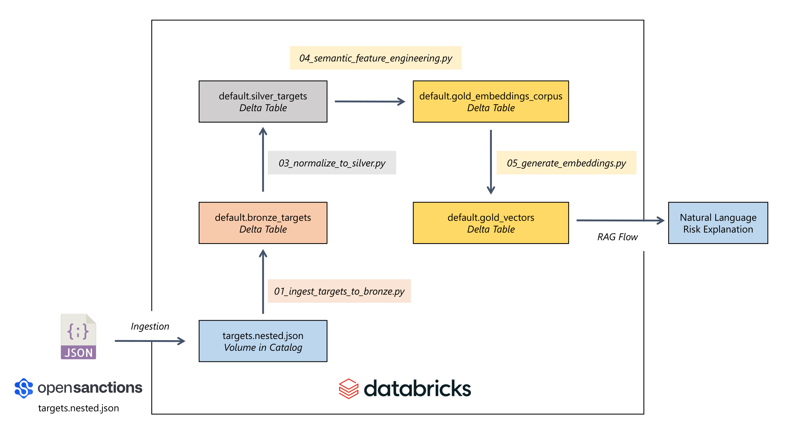
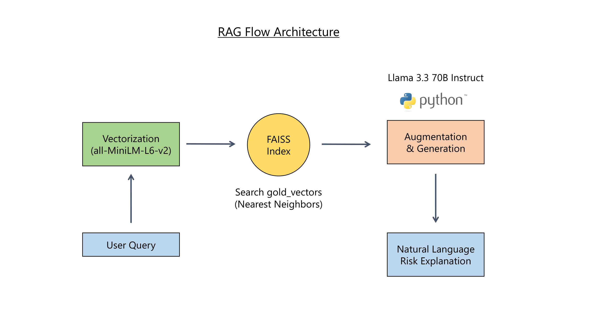
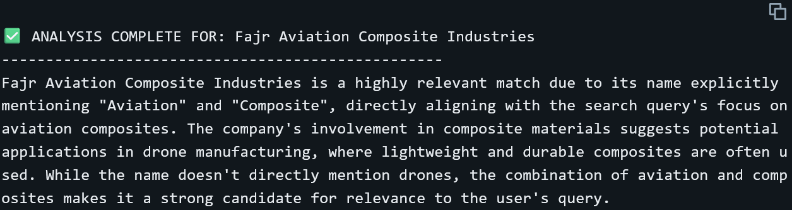
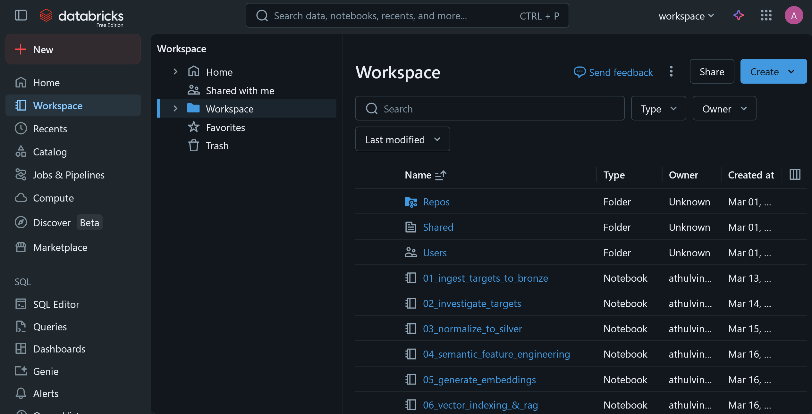
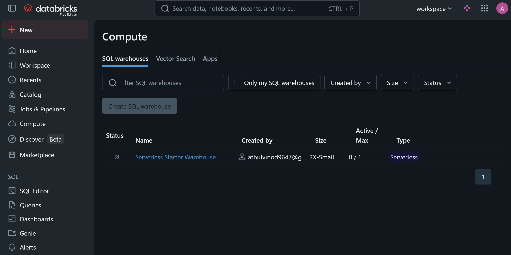
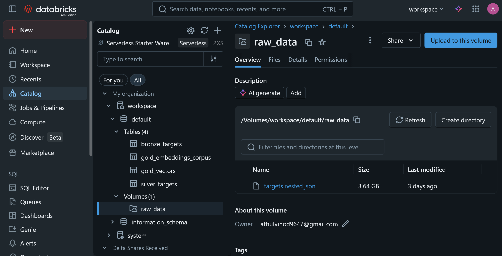
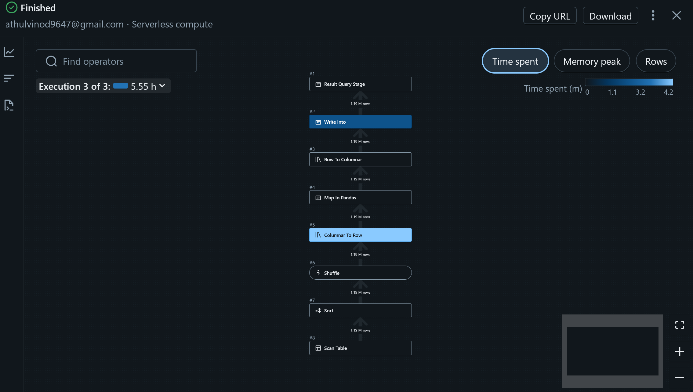

# SanctionsIntel - Semantic Intelligence for KYC & EDD
SanctionsIntel is a data engineering research project focused on the application of semantic analysis to global regulatory datasets. The project utilizes a Lakehouse-based refinement approach to bridge the gap between deterministic entity matching and narrative-driven risk intelligence.

## Table of Contents
1.  [Conceptual Framework](#conceptual-framework)
2.  [Architecture](#architecture)
3.  [Technical Implementation](#technical-implementation)
4.  [Semantic Search & RAG Flow](#semantic-search--rag-flow)
5.  [Setup & Deployment](#setup--deployment)
6.  [Tech Stack](#tech-stack)
7.  [Data Source](#data-source)
8.  [License](#license)

## Conceptual Framework
Financial institutions rely on Know Your Customer (KYC) and Enhanced Due Diligence (EDD) to manage regulatory exposure. While traditional systems focus on deterministic name and identifier matching, regulatory disclosures (such as OFAC or EU sanctions) contain rich narrative descriptions detailing sanctioned behaviors and typologies.

SanctionsIntel structures these complex narratives into a semantically searchable knowledge base. By applying a Bronze–Silver–Gold (medallion) architecture, the system enables the surfacing of contextual risk signals when input narratives exhibit semantic similarity to established regulatory disclosures, allowing analysts to search by "behavior" rather than just by "name."

Instead of just looking for a specific name (like "John Doe"), the system will be able to take a narrative description of a suspicious person and find sanctioned individuals who have done similar things.

Imagine you are a bank investigator. You receive a memo about a new potential client:

`"The subject is a high-net-worth individual involved in shipping specialized electronics to restricted regions in Eastern Europe using front companies in the UAE."`

In a traditional system, searching for that text returns zero results because no one is named "The subject."

Using SanctionsIntel system:
1.  **The Input:** You paste that memo into your Databricks Dashboard.
2.  **The Process (RAG):** The system "vectorizes" that text (turns the meaning into numbers).
3.  **The Match:** It searches our Gold Layer and finds a 92% match with a sanctioned entity from 2024 whose reason field says: `"Exported dual-use technologies through Gulf-based intermediaries to bypass trade barriers."`
4.  **The Result:** You get an alert saying: `"High Semantic Similarity to Known Sanctions Typology."`

## Architecture
**Medallion Data Pipeline (Based on `01` to `05` scripts)**

    
**RAG Flow (Based on script `06`)**

-   **Input:** User text query (e.g., "Aviation industries involving composites").
    
-   **Vectorization:** Query passes through `all-MiniLM-L6-v2` to become a dense vector.
    
-   **Retrieval:** The vector hits a **FAISS Index** (represented as a searchable database node) which queries the `gold_vectors` table to find the Nearest Neighbors.
    
-   **Augmentation & Generation:** The retrieved context (Company Name, Risk Context) + Original Query are sent to **Llama 3.3 70B Instruct**.
    
-   **Output:** The LLM's natural language risk explanation.

-  

## Technical Implementation
The data pipeline utilizes a declarative Medallion Architecture on Databricks, processed via PySpark.

### 1. Bronze Layer (Raw Ingestion)

-   **Script:** `01_ingest_targets_to_bronze.py`
    
-   **Process:** Reads deeply nested JSON data (`targets.nested.json`) using an inferred schema from a 500-record sample. The raw structures, including complex arrays of sanctions and notes, are written cleanly into a Managed Delta Table (`bronze_targets`).
 
### 2. Silver Layer (Normalization & Flattening)

-   **Script:** `03_normalize_to_silver.py`
    
-   **Process:** This layer handles the heavy structural transformations required to make nested NoSQL-style data analytically viable.
    
    -   **Explosion:** Uses `F.explode_outer("properties.sanctions")` to break out individual sanction events into unique rows.
        
    -   **Coalescing Narratives:** Employs `F.concat_ws()` to merge arrays of sanction reasons and programs into readable string payloads.
        
    -   **Metadata Extraction:** Extracts the primary jurisdiction and concatenates provenance datasets to maintain lineage.
        
    -   **Output:** A flattened, analytical table (`silver_targets`) containing `sanction_reason` and `entity_notes`.

### 3. Gold Layer (Feature Engineering & Embeddings)

-   **Scripts:** `04_semantic_feature_engineering.py` & `05_generate_embeddings.py`
    
-   **Process:** Prepares the data for the machine learning workload.
    
    -   **Semantic Merging:** Concatenates entity names, jurisdictions, and risk narratives into a single `doc_text` string to maximize contextual density.
        
    -   **Token-Aware Splitting:** Utilizes LangChain's `RecursiveCharacterTextSplitter` (800 char size, 100 char overlap) applied via a Pandas UDF to handle large text blocks efficiently.
        
    -   **Vectorization:** Leverages Spark's `mapInPandas` for distributed inference. It applies the `all-MiniLM-L6-v2` SentenceTransformer across worker nodes to encode the text chunks into 384-dimensional dense vectors, storing them in `gold_vectors`.

## Semantic Search & RAG Flow
The retrieval engine is decoupled from the data pipeline, ensuring high-speed inference for end-users.

-   **Script:** `06_vector_indexing_&_rag.py`
    
-   **In-Memory Indexing:** The pipeline pulls the 1.19M vectors from the Gold Delta table and converts them into a high-performance `numpy` matrix, building a `faiss.IndexFlatL2` index for sub-second similarity searches.
    
-   **Retrieval-Augmented Generation (RAG):** When a search is executed, the FAISS index identifies the nearest vector distance (e.g., matching "Aviation" and "Composite" concepts). The narrative context of this top hit is injected into a strict, predefined prompt.
    
-   **LLM Orchestration (MLflow):** Leverages the MLflow Deployments SDK to interface with Databricks Foundation Model endpoints. This provides a unified, governed client to manage model discovery and inference for the `Llama 3.3 70B` model.
    
-   **LLM Reasoning:** The Databricks Foundation Model endpoint (`databricks-meta-llama-3-3-70b-instruct`) receives the augmented prompt and acts as an expert analyst, generating a factual, concise explanation of _why_ the identified entity matches the user's risk query.

## Setup & Deployment
To run this project end-to-end using a Databricks Workspace (Free Edition):

1.  **Workspace Preparation**
    
    -   Navigate to your Databricks Workspace.
        
    -   Create a new folder (e.g., `SanctionsIntel`).
        
    -   Import notebooks `01` through `06` into this folder.
        
    -  
        
2.  **Compute / Cluster Creation**
    
    -   Navigate to **Compute** and click **Create Cluster**.
        
    -   Select a Databricks Runtime version for **Machine Learning** (e.g., `14.3 LTS ML` or higher). This ensures necessary libraries like Pandas and PyTorch are pre-configured.
        
    -  
        
3.  **Data Upload (Volumes/DBFS)**
    
    -   Navigate to **Catalog** -> **Volumes** (or DBFS in older editions).
        
    -   Create a directory path matching the scripts (e.g., `/Volumes/workspace/default/raw_data/`).
        
    -   Upload the `targets.nested.json` file.
        
    -  
        
4.  **Pipeline Execution**
    
    -   Attach your cluster to the notebooks.
        
    -   Execute Notebooks `01`, `02`, and `03` to build your Bronze and Silver Delta tables.
        
    -   Execute `04` to split the text. _Note: Ensure the `%pip install langchain_text_splitters` command runs successfully at the top of the notebook._
        
    -   Execute `05`. This notebook utilizes distributed Pandas UDFs to generate embeddings. _(Note: Depending on cluster size, generating 1M+ vectors may take time. You can use `.limit()` on the dataframe for quicker testing)._
        
    -  
        
5.  **Run the RAG Application**
    
    -   Execute Notebook `06`.
        
    -   The notebook will build the FAISS index in memory and prompt the Llama 3.3 model.
        
    -  

## Tech Stack
-   Databricks
-   PySpark
-   Delta Lake
-   LangChain
-   MLflow
-   FAISS
-   Llama 3.3 (70B)
-   SentenceTransformers

## Data Source
The research primarily utilizes the OpenSanctions dataset (https://www.opensanctions.org/datasets/default/), specifically the `targets.nested.json` dataset based on the FollowTheMoney (FTM) data model. This variant provides high-fidelity inclusion of `reason` and `notes` narrative fields, which serve as the primary corpus for semantic embedding and similarity analysis.

## License
Released under the [Apache License 2.0](./LICENSE).
